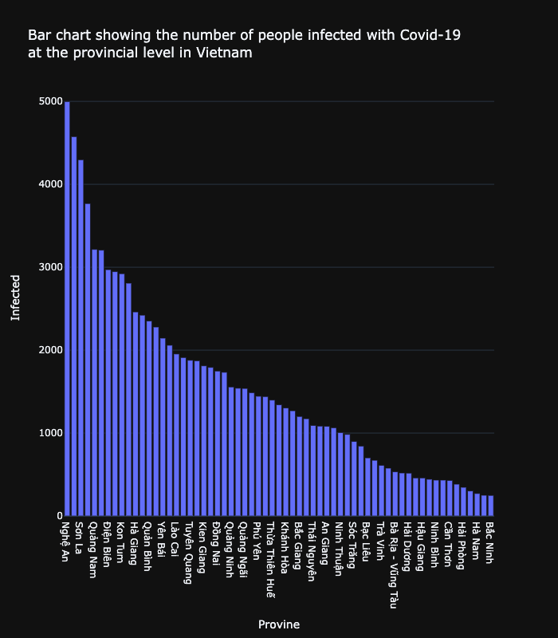

# Covid Tracing using DBSCAN

People who come into contact with someone infected with Covid-19 within a radius of 2m have a high probability of being positive.
These people are called F1 (who has been infected is F0).

With the grouping of people in close contact, the DBSCAN algorithm and the Haversine distance formula (used to calculate the distance of 2 points on the sphere) is a pretty suitable choice for this.

## Data preparation

There are two datasets required:

- The dataset of coordinates of people in Vietnam.
- The dataset of geometry of the province in Vietnam.

### Coordinates dataset

The coordinate will be randomly generated in the bound of Vietnam. This has been done before, so what I need to do now is read the saved CSV file

### Geometry dataset

Geojson file of Vietnam can be found in
[this link](<https://data.opendevelopmentmekong.net/vi/dataset/a-phn-tnh/resource/234169fb-ae73-4f23-bbd4-ff20a4fca401>)

## Libraries

Here are the required libraries to be able to run the file:

- [numpy](https://numpy.org/)
- [pandas](https://pandas.pydata.org/)
- [geopandas](https://geopandas.org/)
- [pycristoforo](https://github.com/AleNegrini/PyCristoforo) for getting Vietnam bounding box
- [sklearn](https://scikit-learn.org/)
- [plotly](https://plot.ly/)
- [shapely](https://shapely.readthedocs.io/)

## Coding process

### Data processing

#### Process coordinates dataset

If there is already a saved CSV file, read it. Otherwise, generate a new one.

Then rename column *lo* to *longitude* and *la* to *latitude*

```python
df = df.rename(columns={'lo': 'longitude', 'la': 'latitude'})
```

Assign id to each row as index

```python
df['id'] = df.index
```

For the column 'infected' it is randomly generated with a rate of 1% positive and 99% negative out of 10,000,000 people

```python
df['infected'] = np.random.choice([True, False],
                                  size=10000000,
                                  p=[0.01, 0.99])
```

Column F1 initially has the value False

```python
df['f1'] = False
```

#### Process geometry dataset

Geometry dataset is a geojson file.
Use `geopandas` to read it.

```python
df_geo = gpd.read_file('./data/diaphantinh.geojson')
```

### DBSCAN

The value to train X is the latitude and longitude that has been converted to radians

```python
X = df[['longitude', 'latitude']].to_numpy()
X = np.radians(X)
```

Initiate the DBSCAN algorithm with:

- Metric: Haversine distance
- Epsilon:
  - The distance to determine close contact is 2 meters
  - Earth's radius is 6371 km
  - So the epsilon is 2/6371 = 0.000011
- Min_samples: As long as 2 people come into contact with each other, it will be considered a cluster
- Algorithm: ball_tree

```python
dbscan = DBSCAN(metric='haversine',
                eps=0.02/6371,
                min_samples=2,
                algorithm='ball_tree')
```

### Result processing

Create a new DataFrame consisting of the original DataFrame combined with the resulting clusters column after fitting the DBSCAN algorithm

```python
df_result = df.assign(cluster=clusters)
```

In this DataFrame, this result only needs people who are F0 and those who are close to each other

```python
df_result = df_result[(df_result['cluster'] != -1) |
                      (df_result['infected'] == True)]
```

People who close contact with someone infected with Covid-19 will be labeled as F1

```python
for index, row in df_result[(df_result['infected'] == True)
                            & (df_result['cluster'] >= 0)].iterrows():
    same_id = retrieve_same_cluster(df_result,
                                    row.id,
                                    exclusive=True).id.values
    df_result.loc[same_id, 'f1'] = True
```

### Result visualization

#### Close contact visualization

Draw a map of people in close contact with each other


Demo a cluster of people in close contact with each other


#### Infected visualization

Draw a map according to the number of people infected with Covid in each province


Besides, there is a column chart showing the number of infected people by province sorted from highest to lowest



### F1 visualization

Similar to above, draw 2 graphs to show people with F1


### Conclusion

Aggregate number of infected people and contacts of infected people represented by grouped bar chart


